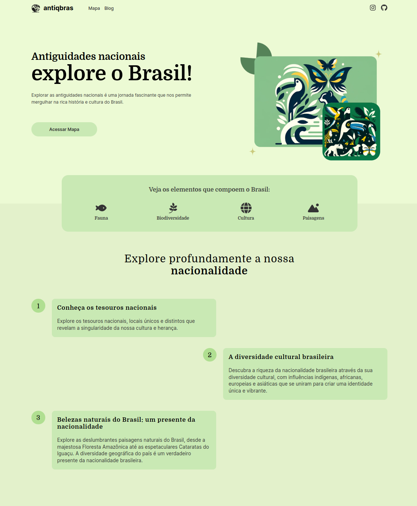

# AntiqBras

  

---

**AntiqBras** is website focused on Brazil's ruins, archaeological sites, and mystical locations, with a twist on nature and wildlife.

It includes an interactive map for exploring these sites and a blog featuring articles on the surrounding natural environment and wildlife.

## Preview

  

  

  

  

  

---

## Features

- Implementing an interactive map to view interesting locations in Brazil.
- Implementing a complete blog API with endpoints for searching, creating, editing and deleting posts ([Blog API](https://github.com/AntiqBras/AntiqBras-Blog-API)).

---

## Installation

To see this project in your machine, you need to follow these steps:

1. Clone the repo: `git clone https://github.com/AntiqBras/AntiqBras`
2. Install the dependencies: `npm i`
3. Run the application: `npm run dev`

---

## Tools

This project uses the following tools:

- [Next.js](https://nextjs.org/) for the front-end
  - [Leaflet](https://leafletjs.com/) for the map integration
- [Golang](https://golang.org/) for the blog's back-end
  - [Gin](https://github.com/gin-gonic/gin)
  - [GORM](https://gorm.io/index.html)
  - [PostgreSQL](https://www.postgresql.org/)
  - [Docker](https://www.docker.com/)

### Blog API

To run the blog's backend, follow the instructions provided in [this repository](https://github.com/AntiqBras/AntiqBras-Blog-API).

---

## Credits

Created by [Isaac Souza](https://github.com/isaacszf).
